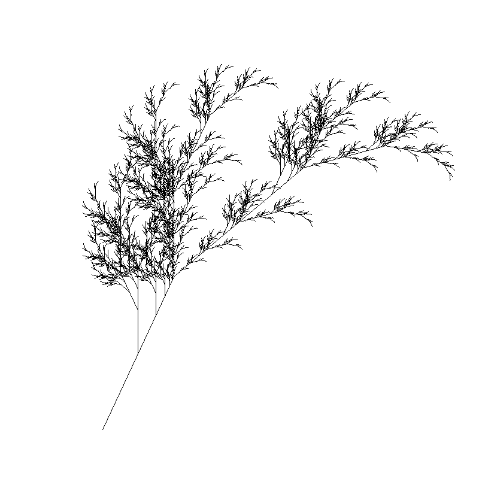
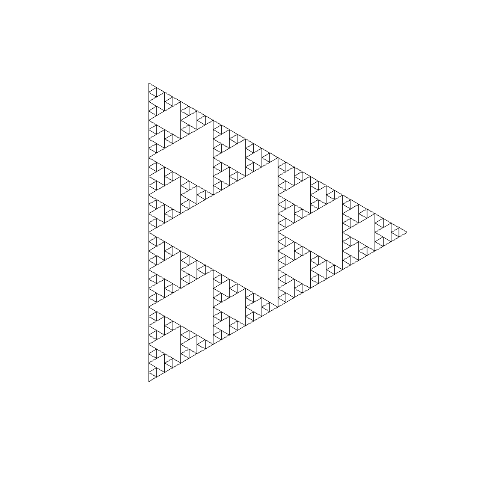

# lsystem

A simple L-System visualizer written in Haskell


*Fractal Plant*

*Sierpinski Triangle*


Default symbols:

| Symbol | Function      |
| ------ | ------------- |
| F      | Draw forward  |
| B      | Draw backward |
| f      | Move forward  |
| b      | Move backward |
| +      | Rotate right  |
| -      | Rotate left   |
| [      | Push position |
| ]      | Pop position  |

## How to run

```text
Usage: lsystem [-u|--unit-length ARG] [-n|--number-of-generation ARG] 
                   [-f|--forward ARG] [-b|--backward ARG] [-d|--debug] [FILE]

Available options:
  -u,--unit-length ARG     Unit length (default: 32.0)
  -n,--number-of-generation ARG
                           Number of generation to run (default: 2)
  -f,--forward ARG         Drawing forward symbols (default: "")
  -b,--backward ARG        Drawing backward symbols (default: "")
  -d,--debug               Debug mode - print all performed steps
  -h,--help                Show help text
```

## Roadmap

- [x] Basic features
- [x] Unit test
- [x] Parameterized rules
- [ ] Stochastic
- [ ] Graphic primitives (colors, texts, arcs, etc.)
- [ ] Animation
- [ ] Static picture export
